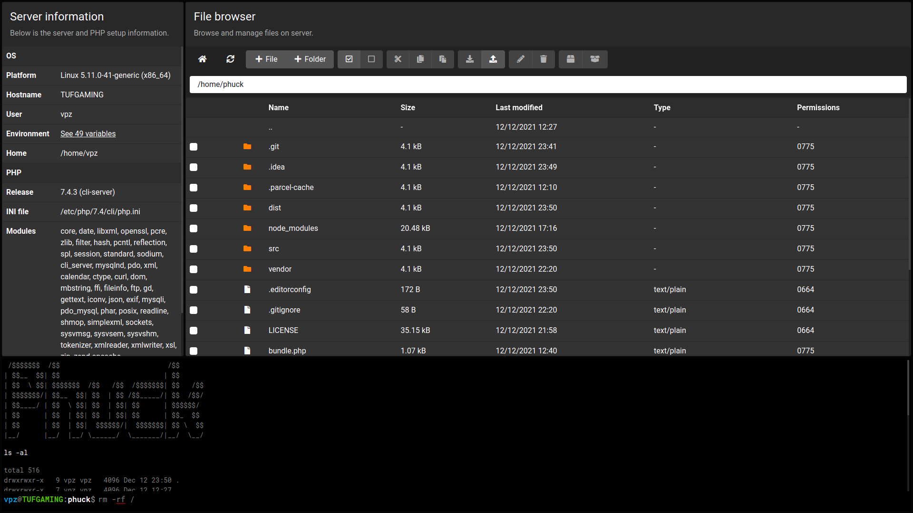

# phuck

Single-file shell to f__k vulnerable [PHP](https://www.php.net/) servers, solely for educational and research purposes.
Powered by [Bootstrap](https://getbootstrap.com/) and [React.js](https://reactjs.org/), features a file browser and web based, [SSH](https://en.wikipedia.org/wiki/Secure_Shell) like terminal.

[](screenshot.png)

**Caution:** This file if publicly accessible, is a total security risk. Do not upload or use it in a production environment.

## Download

You can get the latest `phuck.dist.php` from the [releases](releases) section.

## Testing

Make sure to have [PHP](https://www.php.net/), [Composer](https://getcomposer.org/), [Node.js](https://nodejs.org/en/) and [Yarn](https://yarnpkg.com/) installed on your workstation.

Firstly, dump the autoloader and install [JavaScript](https://www.javascript.com/) dependencies using below command:

```shell
# generate auto loader
composer dump-autoload

# install JS dependencies
yarn install
```

Then start the [PHP](https://www.php.net/) built-in [development server](https://www.php.net/manual/en/features.commandline.webserver.php) in project directory.

```shell
php -S localhost:8080
```

Now run the [Parcel](https://parceljs.org/) development server:

```shell
RPC_URL=http://localhost:8080/phuck.dev.php npx parcel src/index.html
```

## Building

To create your own bundled version after any changes, run below commands:

```shell
# build frontend assets
npx parcel build src/index.html

# combine frontend and server code
php bundle.php
```

You should now have a `phuck.dist.php` in the project root.

## License

See [LICENSE](LICENSE) file.
